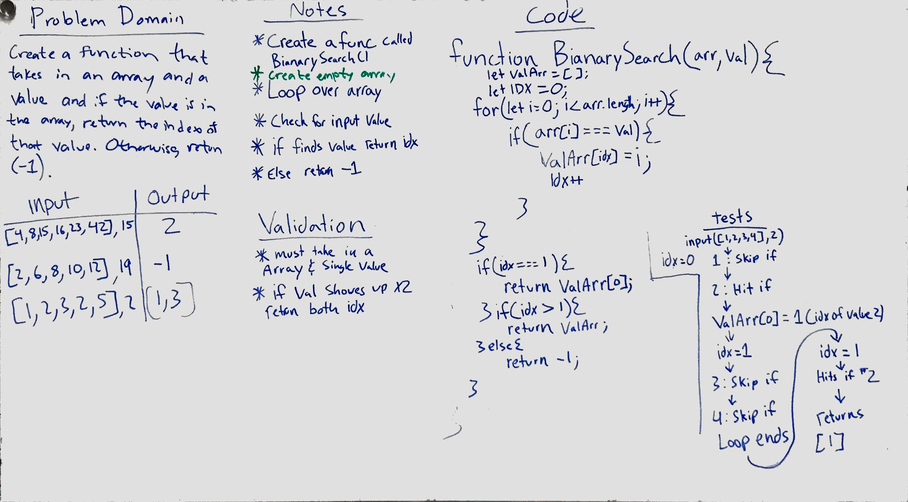

# Reverse an Array
<!-- Short summary or background information -->
Write a function that takes in a array and value, and check if that value appears in the array. If it does return the index location of where that value appears.
ex. `BianarySearch([1,2,3], 2)` should `return 1`.

## Challenge
<!-- Description of the challenge -->
Write a function called BinarySearch which takes in 2 parameters: a sorted array and the search key. Without utilizing any of the built-in methods available to your language, return the index of the array’s element that is equal to the search key, or -1 if the element does not exist.

## Approach & Efficiency
<!-- What approach did you take? Why? What is the Big O space/time for this approach? -->
Created a function called bianary search that took in a array and a value. Then created a empty array and a variable called idx that stored the value 0. We then looped over the array checking to see if any of the array values equaled the value inputed to the function. If it did we would push the index to the empty array and increase the variable idx by one. we then check the idx number at the end and based our return value off of that. 
 

## Solution
<!-- Embedded whiteboard image -->
