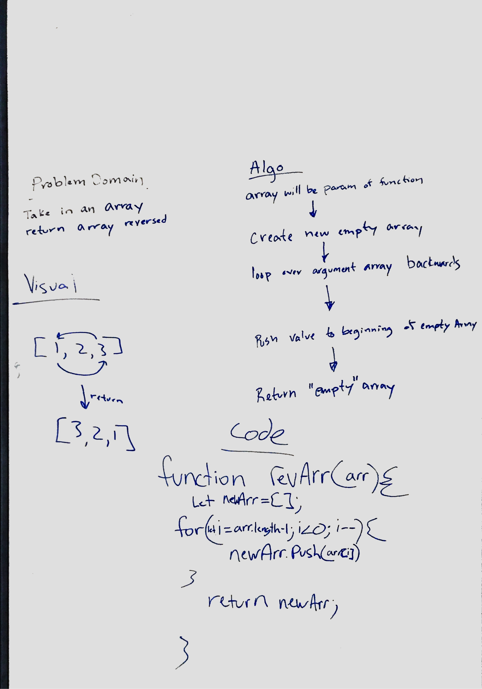

# Reverse an Array
<!-- Short summary or background information -->
Create a function that reverses any array. ex [1,2,3] --> [3,2,1]

## Challenge
<!-- Description of the challenge -->
Write a function called reverseArray which takes an array as an argument. Without utilizing any of the built-in methods available to your language, return an array with elements in reversed order.

## Approach & Efficiency
<!-- What approach did you take? Why? What is the Big O space/time for this approach? -->
We used a for loop and looped over our array backwords pushing each value to a new array then returning the new array after the loop ends. 

## Solution
<!-- Embedded whiteboard image -->
