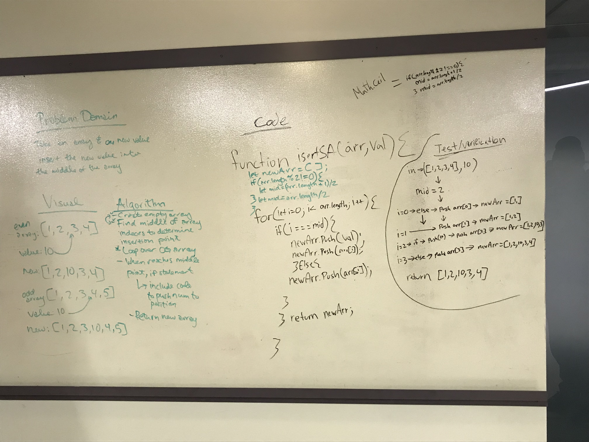

# Reverse an Array
<!-- Short summary or background information -->
Create a function takes in a array and value and inserts that value into the middle of the array. ex ([1,2,3,4],10) --> [1,2,10,3,4]

## Challenge
<!-- Description of the challenge -->
Write a function called insertShiftArray which takes in an array and the value to be added. Without utilizing any of the built-in methods available to your language, return an array with the new value added at the middle index.

## Approach & Efficiency
<!-- What approach did you take? Why? What is the Big O space/time for this approach? -->
For this we started with creating a empty array named in newArray. The we used a ternary to act as a `Math.ceil()` method to make sure we didnt get any midpoints with a decimal value. After that we set up a for loop to loop over the array pushing the index value of that array to our new array. In that loop we had a if statement that stated `if(i === mid)` then to push out target value first then the index value. 

## Solution
<!-- Embedded whiteboard image -->
