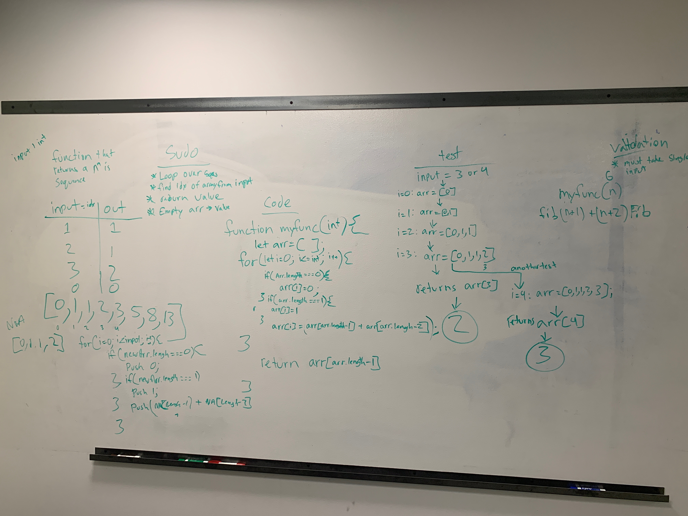

# Feature Tasks
<!-- Short summary or background information -->
Write a function to accepts an integer, and returns the nth number in the Fibonacci sequence

## Approach & Efficiency
<!-- What approach did you take? Why? What is the Big O space/time for this approach? -->
Created a function that took in a number as a input and used it to loop over each time checking the length of arr and having that decide the gets pushed to the array. and the end I was able to return the last index of the array

## What I Could Do To Improve?
I think I did a well on this challange, my code was able to run and though I had a fairly efficent testing method. I did have a few moments of silence at the beggening and struggled for a bit to wrap my head around the pattern and what I needed to return but I feel that was due to my little knowledge of the Fibonacci Sequence. I think doing these labs help alot esspecially when we try to simmulate a real interview as much as possible. 
 

## Solution
<!-- Embedded whiteboard image -->
