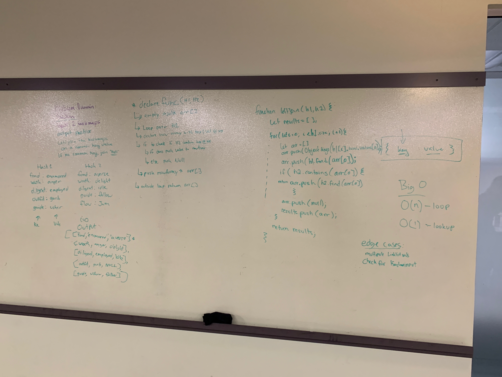

# Code Challenge 28
### leftJoin

## Challenge
Write a function that LEFT JOINs two hashmaps into a single data structure. The first parameter is a hashmap that has word strings as keys, and a synonym of the key as values. The second parameter is a hashmap that has word strings as keys, and antonyms of the key as values. Combine the key and corresponding values (if they exist) into a new data structure according to LEFT JOIN logic. If no values exist in the right hashmap, then some flavor of NULL should be appended to the result row.

## Approach & Efficiency
Big O
0(n)

## Solution

