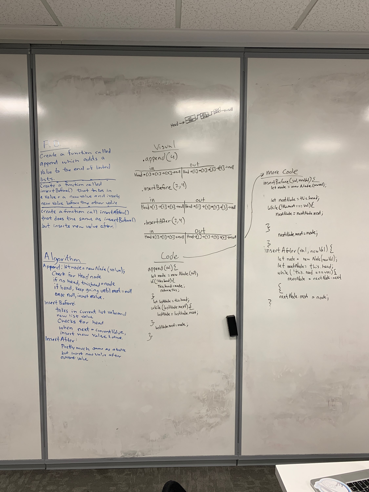

 LAB
=================================================

## code challange 06

### Author: Tanner Seramur

### Links and Resources
* [repo](https://github.com/TannerSeramur/data-structures-and-algorithms)

### Modules
#### `Jest.js`
#### `EsLint`
##### Exported Values and Methods
###### `class LinkedList`

###### `insert(value)`
Insets a value to the end of a linkedList

###### `insertBefore(value, newValue)`
Inserts a new value before any given value in the array

###### `insertAfter(value, newValue)`
Inserts a new value after any given value in the array

#### Tests
* `npm test` in test folder
* Endpoint: `/`
  * All test pass

#### UML
