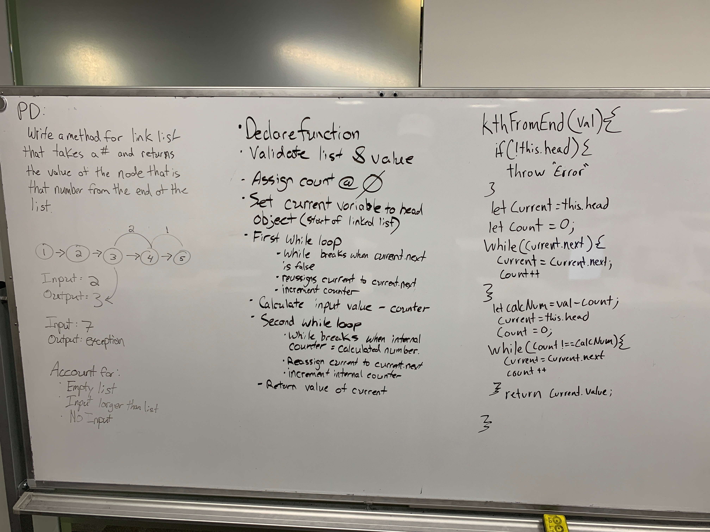

 LAB
=================================================

## code challange 06 & 07

### Author: Tanner Seramur

### Links and Resources
* [repo](https://github.com/TannerSeramur/data-structures-and-algorithms)

#### Challange 06
`.append(value)` which adds a new node with the given `value` to the end of the list

`.insertBefore(value, newVal)` which add a new node with the given `newValue` immediately before the first `value` node

`.insertAfter(value, newVal)` which add a new node with the given `newValue` immediately after the first `value` node

#### Challange 07
Write a method for the Linked List class which takes a number as a parameter. Return the node’s value that is from the end of the linked list. You have access to the Node class and all the properties on the Linked List class as well as the methods created in previous challenges.

### Modules
#### `Jest.js`
#### `EsLint`
##### Exported Values and Methods
###### `class LinkedList`

###### `insert(value)`
Insets a value to the end of a linkedList

###### `insertBefore(value, newValue)`
Inserts a new value before any given value in the array

###### `insertAfter(value, newValue)`
Inserts a new value after any given value in the array

###### `kthFromEnd(val)`
returns the index location of that value

#### Tests
* `npm test` in test folder
* Endpoint: `/`
  * All test pass

#### UML
##### Challange 06

##### Challange 07
