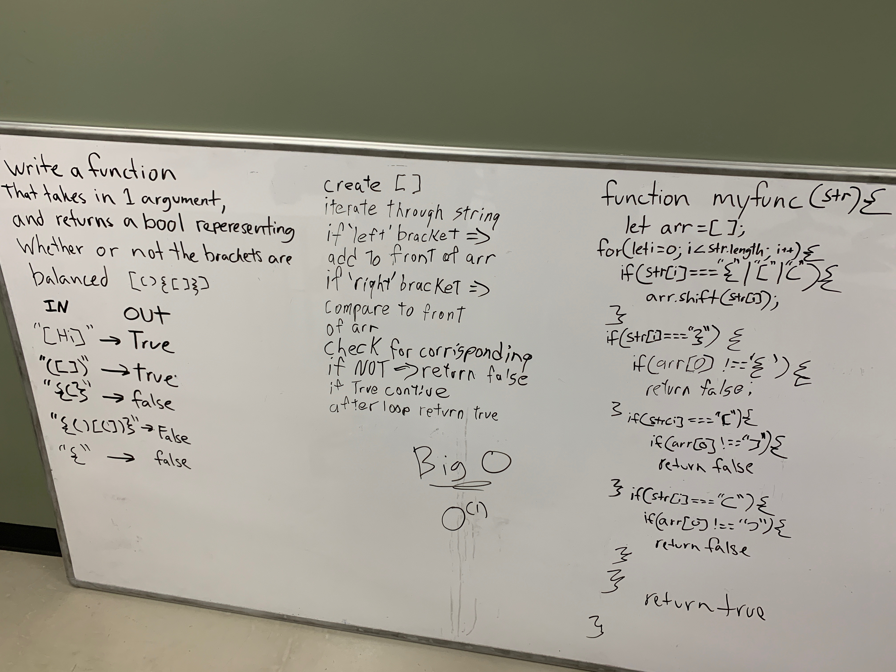

### Modules
#### `multi-bracket-validation.js`

### Links and Resources

* [repo](https://github.com/TannerSeramur/data-structures-and-algorithms)

#### Tests
* npm test (runs unit tests)
* npm run lint (runs linter tests)

# Multi Bracket Validation
1/9/2019 Tanner and Jared

## Challenge
### Canvas instructions:  
* Your function should take a string as its only argument, and should return a boolean representing whether or not the brackets in the string are balanced. There are 3 types of brackets:

Round Brackets : ()
Square Brackets : []
Curly Brackets : {}

## Approach & Efficiency 
* Examined problem domain
* Visualization
* Formulated algorithm
* Wrote pseudoQueue function
* Wrote checks for function
* Identified Efficiency
* Wrote test assertions 

## Solution
