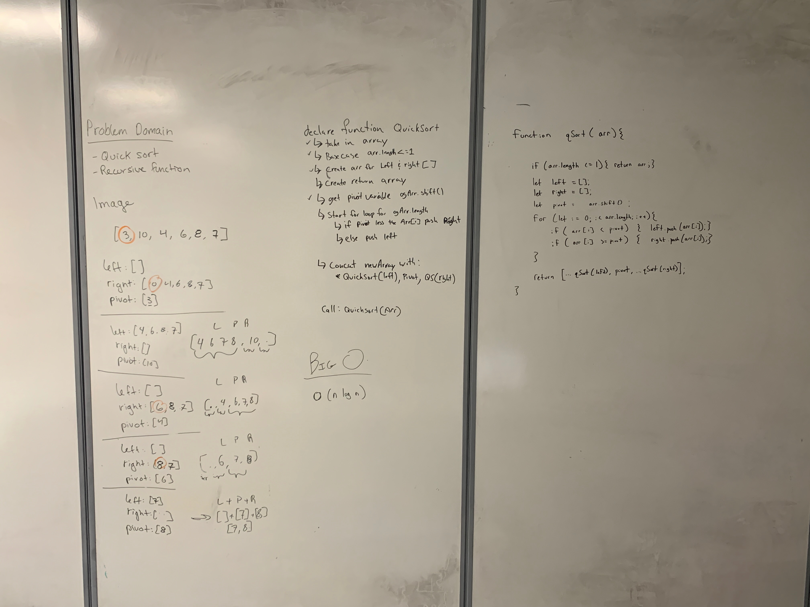

# Implement Quicksort
## Challenge
Write a function that accepts an array of integers, and returns an array sorted by a recursive quicksort algorithm.

## Approach & Efficiency
Big O
0(n)
o(log n)

## Solution

