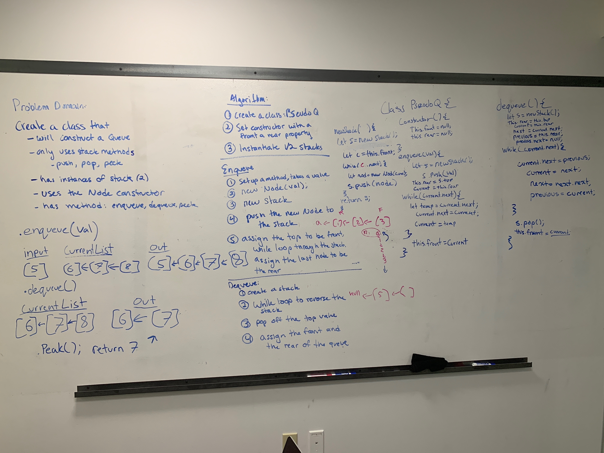

# Implement a Queue using two Stacks.
## Challenge
Create a brand new PseudoQueue class. Do not use an existing Queue. Instead, this PseudoQueue class will implement the standard queue interface, but will internally only utilize 2 Stack objects.

## Approach & Efficiency
After struggling to figure out what the challenge was asking for us to do we finally were able to find this solution where we used the PseudoQueue constuctor to genorate 2 stacked lists. We then were able to push values to a stacked lists depending on the size of the lists. We we able to 

## Solution
