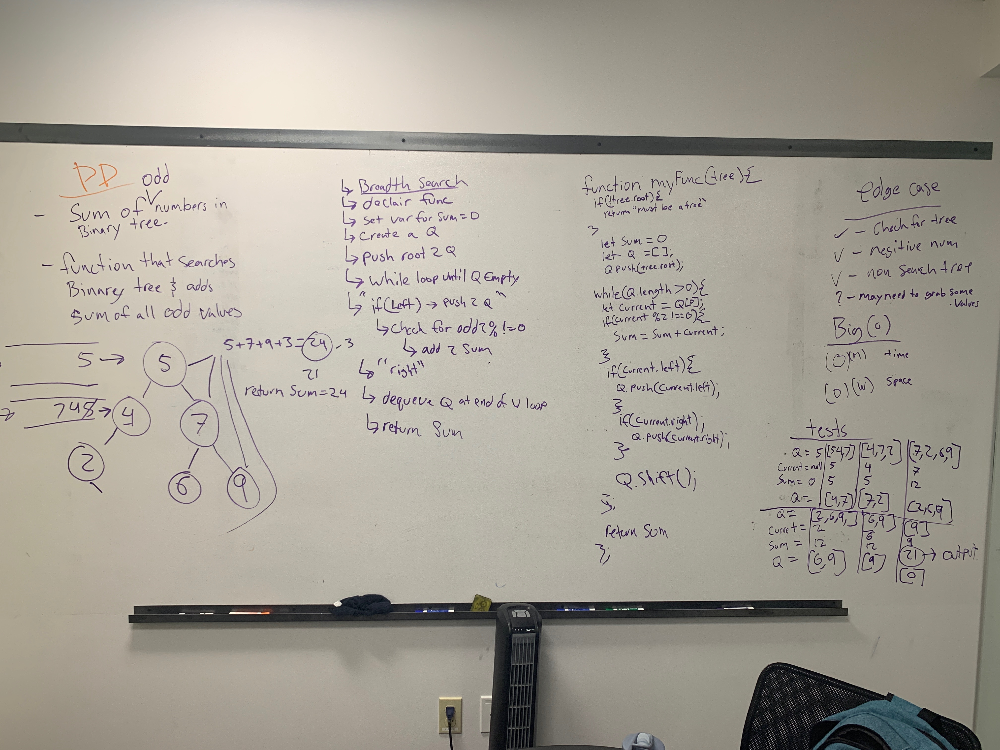
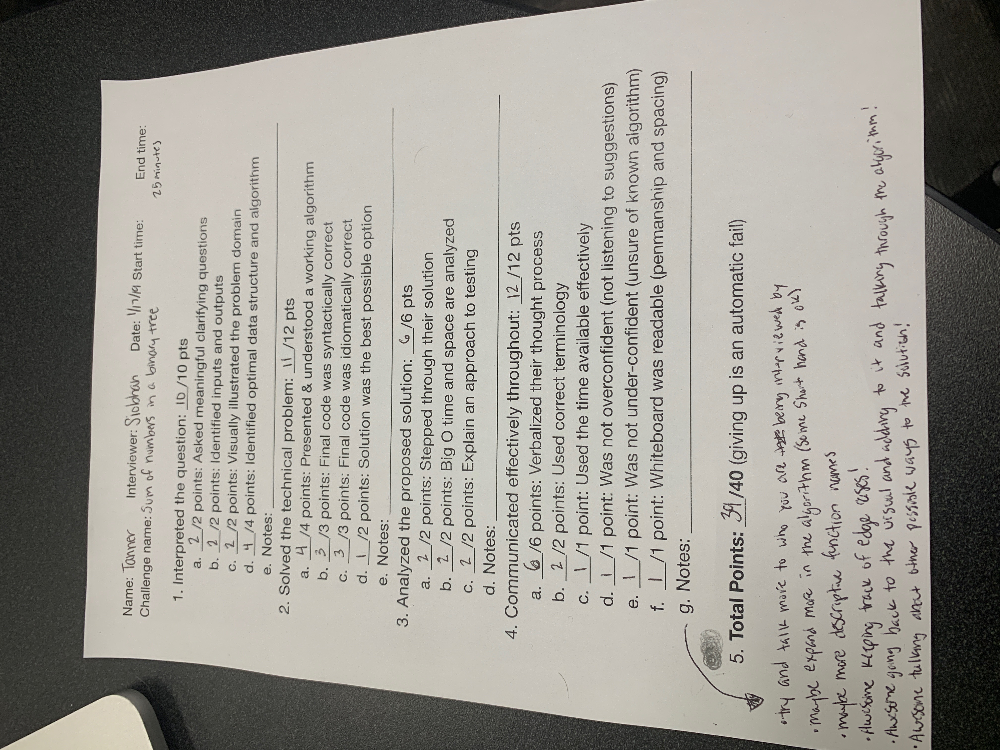

# Code Challenge 19

## Whiteboard
### Question: Find the sum of all the odd numbers in a binary search tree. 

## Evaluation 

## Stratagy 
I used a breath first search to go through every value in the tree and check to see if they were odd and when I found a odd value I added to the sum variable that I had declaired.